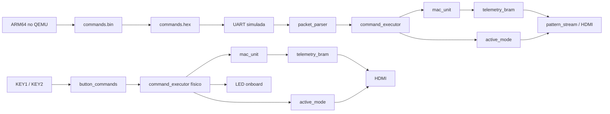

# Projeto Final ARM64 + FPGA

Projeto final da disciplina de **Sistemas Digitais Embarcados**, desenvolvido como consolidação dos TPs anteriores.

A solução integra:

- **Assembly AArch64/ARM64**, executado no **QEMU**;
- geração de comandos estruturados com **CRC-8**;
- **co-simulação ARM64 → FPGA** por UART simulada;
- lógica digital em **Verilog**;
- processamento **MAC (Multiply-Accumulate)** em ponto fixo **Q8.8**;
- armazenamento de telemetria em **BSRAM/BRAM**;
- implementação física na **Sipeed Tang Nano 4K**;
- saída de vídeo **HDMI** com quatro modos de visualização;
- **LED onboard** para sinalização de comando e erros;
- validação por testbenches, waveforms, síntese, Place & Route, timing e testes físicos.

> **Importante:** a integração ARM64–FPGA foi validada por **co-simulação**, usando os bytes realmente produzidos pelo executável AArch64 no QEMU.  
> Na implementação física atual, a Tang Nano 4K recebe comandos pelos **botões da própria placa**. Não existe, nesta versão, uma UART física ligando diretamente o QEMU/PC à FPGA.

---

## 1. Objetivo

O objetivo do projeto é demonstrar uma arquitetura embarcada completa formada por:

```text
entrada
  ↓
validação de comandos
  ↓
controle
  ↓
processamento numérico
  ↓
memória
  ↓
visualização e diagnóstico
```

Na co-simulação, o ARM64 gera os pacotes e a lógica FPGA os recebe, valida e executa.

Na placa física, os botões locais geram comandos equivalentes para exercitar o mesmo tipo de fluxo interno, enquanto o HDMI torna o estado do sistema visível.

---

## 2. Visão geral da arquitetura



O projeto possui duas frentes complementares:

### Co-simulação ARM64 → FPGA

```text
Assembly ARM64
    ↓
QEMU
    ↓
commands.bin
    ↓
bin_to_hex.py
    ↓
commands.hex
    ↓
UART simulada
    ↓
packet_parser
    ↓
command_executor
    ↓
ACK / erro / estado
```

### Implementação física

```text
KEY1 / KEY2
    ↓
sincronização + debounce
    ↓
button_commands
    ↓
command_executor
    ↓
MAC + BSRAM + active_mode
    ↓
HDMI + LED onboard
```

---

## 3. Hardware utilizado

- **Sipeed Tang Nano 4K**
- FPGA da família **Gowin GW1NSR**
- cabo USB-C
- cabo HDMI
- monitor/TV com entrada HDMI
- computador Windows com **Gowin EDA**
- **WSL/Ubuntu** para Assembly, QEMU e simulação

Não são necessários LEDs externos, resistores ou protoboard na versão final.

---

## 4. Ferramentas

### No WSL/Ubuntu

- GNU Make
- binutils AArch64
- QEMU user mode
- Python 3
- Icarus Verilog
- GTKWave
- Git

Instalação:

```bash
sudo apt update
sudo apt install -y \
  make \
  binutils-aarch64-linux-gnu \
  qemu-user \
  python3 \
  iverilog \
  gtkwave \
  git
```

Verificação:

```bash
aarch64-linux-gnu-as --version
qemu-aarch64 --version
python3 --version
iverilog -V
gtkwave --version
make --version
```

### No Windows

- **Gowin EDA / Gowin FPGA Designer**
- **Gowin Programmer**

Dispositivo utilizado no projeto:

```text
GW1NSR-LV4CQN48PC6/I5
```

---

## 5. Estrutura de diretórios

```text
final_project/
├── README.md
├── Makefile
│
├── arm64/
│   ├── Makefile
│   ├── src/
│   │   ├── main.s
│   │   ├── packet.s
│   │   └── syscalls.s
│   └── build/                  # gerado
│
├── bridge/
│   ├── bin_to_hex.py
│   └── check_packets.py
│
├── docs/
│   └── protocol.md
│
├── evidence/
│   ├── waveforms/
│   ├── synthesis/
│   ├── hardware/
│   └── logs/
│
└── fpga/
    ├── bringup/
    │   ├── onboard_led_bringup.v
    │   └── onboard_led_bringup.cst
    │
    ├── constraints/
    │   ├── final.cst
    │   └── final.sdc
    │
    ├── rtl/
    │   ├── top_final.v
    │   ├── protocol_system.v
    │   │
    │   ├── common/
    │   │   ├── reset_sync.v
    │   │   └── sync2ff.v
    │   │
    │   ├── control/
    │   │   ├── command_executor.v
    │   │   ├── packet_parser.v
    │   │   ├── response_builder.v
    │   │   ├── uart_rx.v
    │   │   └── uart_tx.v
    │   │
    │   ├── dsp/
    │   │   └── mac_unit.v
    │   │
    │   ├── io/
    │   │   ├── debounce_pulse.v
    │   │   ├── button_commands.v
    │   │   └── led_status.v
    │   │
    │   ├── memory/
    │   │   └── telemetry_bram.v
    │   │
    │   └── video/
    │       ├── pattern_stream.v
    │       └── svo_hdmi_final.v
    │
    ├── sim/
    │   ├── Makefile
    │   ├── tb_mac_unit.v
    │   ├── tb_led_status.v
    │   ├── tb_pattern_stream.v
    │   ├── tb_arm_fpga_protocol.v
    │   ├── commands.hex        # gerado
    │   └── build/              # gerado
    │
    ├── third_party/
    │   └── TangNano-4K-example/
    │
    ├── gowin/
    │   ├── final_project.gprj
    │   ├── src/
    │   └── impl/
    │
    └── release/
```

Arquivos como `commands.bin`, `commands.hex`, `.vvp`, `.vcd`, `impl/` e o bitstream `.fs` são **gerados pelas ferramentas**.

---

## 6. Base HDMI oficial

O pipeline HDMI utiliza arquivos do projeto oficial da Sipeed para a Tang Nano 4K.

A referência deve ser mantida em:

```text
fpga/third_party/TangNano-4K-example/
```

A cópia de trabalho utilizada pelo Gowin fica em:

```text
fpga/gowin/
```

Os arquivos oficiais de SVO/TMDS, PLLVR e CLKDIV devem ser preservados.

A versão em `third_party/` deve ser tratada como referência limpa e não deve ser modificada.

---

## 7. Protocolo ARM64 → FPGA

Cada comando possui **10 bytes**:

| Byte | Campo | Descrição |
|---:|---|---|
| 0 | SOF | `0xA5` |
| 1 | Versão | `0x01` |
| 2 | Sequência | incrementada a cada comando |
| 3 | Comando | identificador da operação |
| 4 | Length | quantidade de bytes úteis do payload |
| 5–8 | Payload | até 4 bytes |
| 9 | CRC-8 | calculado sobre os bytes 1 a 8 |

CRC utilizado:

```text
polinômio: 0x07
init:      0x00
refin:     false
refout:    false
xorout:    0x00
```

### Comandos

| ID | Comando | Função |
|---:|---|---|
| `0x01` | `SET_MODE` | altera o modo de vídeo |
| `0x02` | `SET_COLOR` | altera a cor base |
| `0x03` | `SET_GAIN` | altera o ganho Q8.8 |
| `0x04` | `MAC_STEP` | executa uma operação MAC |
| `0x05` | `CLEAR` | limpa estado, MAC e alertas |
| `0x06` | `GET_STATUS` | consulta o estado |
| `0x7F` | `PING` | teste de comunicação |

### Status de resposta usados nos testes

| Status | Significado |
|---:|---|
| `0x00` | ACK / comando aceito |
| `0x01` | CRC inválido |
| `0x02` | sequência duplicada |

---

## 8. Executando o ARM64 no QEMU

A partir da raiz de `final_project`:

```bash
make clean
make -C arm64 check
```

O fluxo executa:

1. montagem de `main.s`;
2. montagem de `packet.s`;
3. montagem de `syscalls.s`;
4. linkagem do executável AArch64;
5. execução com `qemu-aarch64`;
6. criação de `commands.bin`;
7. conversão para `commands.hex`;
8. validação dos oito pacotes.

Resultado esperado:

```text
resultado: 8 PASS, 0 FALHA
```

Confirme os arquivos gerados:

```bash
wc -c arm64/build/commands.bin
wc -l fpga/sim/commands.hex
head -20 fpga/sim/commands.hex
```

Resultado esperado:

```text
commands.bin = 80 bytes
commands.hex = 80 linhas
```

---

## 9. Executando todas as simulações FPGA

```bash
make -C fpga/sim all
```

Resultado esperado:

```text
PASS tb_mac_unit
PASS tb_led_status
PASS tb_pattern_stream: active_mode 00/01/10/11 visivel no HDMI
PASS integracao ARM64 FPGA: 8 ACK, CRC e duplicata detectados
```

Também é possível executar todo o fluxo a partir da raiz:

```bash
make clean
make all
```

O `Makefile` principal executa primeiro a validação ARM64 e depois os testbenches FPGA.

---

## 10. Testbenches

### `tb_mac_unit.v`

Valida a unidade MAC:

```text
operandos
   ↓
multiplicação
   ↓
acumulador
   ↓
resultado Q8.8
   ↓
done / overflow
```

### `tb_led_status.v`

Valida os padrões do LED onboard:

- comando aceito;
- erro de protocolo/comando;
- erro grave;
- limpeza por `CLEAR`.

### `tb_pattern_stream.v`

Valida que os quatro valores de `active_mode` são representados corretamente no gerador de vídeo:

```text
00
01
10
11
```

### `tb_arm_fpga_protocol.v`

É o teste de integração.

Ele usa os bytes produzidos pelo ARM64 e simula:

```text
commands.hex
    ↓
UART bit a bit
    ↓
packet_parser
    ↓
CRC / sequência
    ↓
command_executor
    ↓
resposta
```

O teste também injeta:

- um pacote com CRC incorreto;
- um pacote com sequência repetida.

---

## 11. Visualizando waveforms

Integração ARM64–FPGA:

```bash
gtkwave fpga/sim/build/tb_arm_fpga_protocol.vcd
```

Sinais úteis:

```text
uart_rx_line
cmd_valid
cmd_id
cmd_payload
response_valid
response_status
active_mode
active_color
gain_q88
mac_result_q88
error_count
```

MAC:

```bash
gtkwave fpga/sim/build/tb_mac_unit.vcd
```

LED:

```bash
gtkwave fpga/sim/build/tb_led_status.vcd
```

---

## 12. Unidade MAC

MAC significa **Multiply-Accumulate**:

```text
acumulador_novo = acumulador_anterior + (A × B)
```

Os operandos utilizam **Q8.8**, formato de ponto fixo de 16 bits.

Exemplos:

```text
0x0100 = +1,0
0x0080 = +0,5
0xFF00 = -1,0
```

O projeto utiliza:

- multiplicação 16 × 16 bits;
- acumulador de 32 bits;
- sinalização de overflow;
- saturação;
- conversão do resultado para Q8.8.

Na síntese física, a multiplicação pode ser mapeada para o bloco DSP dedicado da FPGA.

---

## 13. Telemetria em BSRAM

Os resultados do MAC são armazenados em:

```text
telemetry_bram
```

A memória possui **1024 posições de 16 bits** para resultados Q8.8.

Essa memória alimenta o modo de telemetria do HDMI.

O projeto não utiliza framebuffer completo para a imagem.

Um framebuffer de 640 × 480 com 1 byte por pixel exigiria:

```text
640 × 480 × 1 = 307200 bytes
```

Por isso, os pixels dos modos visuais são gerados **proceduralmente**, e a BSRAM fica reservada para a telemetria.

---

## 14. Modos HDMI

`active_mode` possui dois bits.

| `active_mode` | Saída HDMI |
|---|---|
| `00` | barras de cores |
| `01` | padrão xadrez |
| `10` | gradiente RGB |
| `11` | gráfico de telemetria do MAC |

Além do padrão principal, dois pequenos quadrados no canto superior direito representam os bits:

```text
quadrado esquerdo → active_mode[1]
quadrado direito  → active_mode[0]

branco       → 1
cinza escuro → 0
```

O HDMI funciona como painel visual do estado interno da FPGA.

---

## 15. LED onboard

O projeto final utiliza somente o LED onboard da Tang Nano 4K.

Pinagem:

```text
led_pin → pino 10
```

Comportamento:

| Evento | LED |
|---|---|
| comando aceito | 1 piscada curta |
| erro de protocolo/comando | 2 piscadas |
| erro grave / MAC overflow | piscada rápida contínua até `CLEAR` |

O LED não representa `active_mode`; essa função pertence ao HDMI.

---

## 16. Controles físicos

### KEY1

Gera um comando equivalente a `SET_MODE`.

Cada acionamento percorre:

```text
00 → 01 → 10 → 11 → 00 ...
```

### KEY2

Gera:

```text
MAC_STEP
```

Cada acionamento executa uma nova operação MAC.

No modo `11`, o novo resultado pode ser observado na telemetria HDMI.

### KEY1 + KEY2

Gera:

```text
CLEAR
```

A operação limpa:

- estado do MAC;
- telemetria;
- alertas de erro.

---

## 17. Clocks

Clock de entrada da placa:

```text
27 MHz
```

Pipeline principal:

```text
27 MHz
   ↓
Gowin_PLLVR
   ↓
126 MHz
   ↓
Gowin_CLKDIV
   ↓
25,2 MHz
```

O clock de 25,2 MHz é utilizado no domínio de pixels.

---

## 18. Projeto físico no Gowin

Abra:

```text
fpga/gowin/final_project.gprj
```

Dispositivo:

```text
GW1NSR-LV4CQN48PC6/I5
```

### Top module

O top físico final deve ser:

```text
top_final
```

### Constraints ativas

Use:

```text
fpga/constraints/final.cst
fpga/constraints/final.sdc
```

As antigas:

```text
src/hdmi.cst
src/hdmi.sdc
```

não devem permanecer ativas ao mesmo tempo.

### Arquivos autorais usados no hardware físico

```text
reset_sync.v
sync2ff.v
debounce_pulse.v
button_commands.v
led_status.v
command_executor.v
mac_unit.v
telemetry_bram.v
pattern_stream.v
svo_hdmi_final.v
top_final.v
```

### Arquivos exclusivos da co-simulação

Não são necessários no `top_final` físico:

```text
protocol_system.v
uart_rx.v
uart_tx.v
packet_parser.v
response_builder.v
tb_*.v
```

---

## 19. Síntese e implementação

No Gowin:

```text
Synthesize
    ↓
Place & Route
    ↓
Timing Analysis
    ↓
Programmer
```

Após a síntese, confira se aparecem recursos equivalentes a:

- `MULTADDALU18X18` / DSP;
- BSRAM;
- `Gowin_PLLVR`;
- `Gowin_CLKDIV`;
- `OSER10`;
- `ELVDS_OBUF`.

Também verifique:

- Resource Utilization;
- Timing Analysis;
- Ports & Pins Report.

Na implementação validada durante o desenvolvimento, o domínio de pixels foi restringido a **25,2 MHz** e os relatórios detalhados de timing apresentaram margens positivas nos caminhos analisados.

---

## 20. Programação da placa

Após Synthesize e Place & Route:

1. conecte a Tang Nano 4K ao computador;
2. conecte a saída HDMI da Tang Nano diretamente ao monitor;
3. abra o **Programmer**;
4. selecione o `.fs` recém-gerado;
5. programe inicialmente em **SRAM**;
6. confira a saída HDMI;
7. teste KEY1, KEY2 e KEY1+KEY2.

> A porta HDMI da Tang Nano é uma **saída**. Conecte-a a uma entrada HDMI do monitor.

---

## 21. Resultado esperado no hardware

Após programar `top_final`:

1. o monitor recebe sinal HDMI;
2. KEY1 percorre os quatro modos;
3. os indicadores binários acompanham `active_mode`;
4. KEY2 executa novas operações MAC;
5. o modo 11 mostra a telemetria;
6. o LED onboard pisca ao receber comandos;
7. KEY1 + KEY2 executa `CLEAR`.

---

## 22. Evidências

As evidências do projeto devem ser mantidas em:

```text
evidence/
├── waveforms/
├── synthesis/
├── hardware/
└── logs/
```

Entre as evidências coletadas estão:

- execução do ARM64 no QEMU;
- `commands.bin` com 80 bytes;
- `commands.hex` com 80 linhas;
- `8 PASS, 0 FALHA`;
- `PASS tb_mac_unit`;
- `PASS tb_led_status`;
- `PASS tb_pattern_stream`;
- `PASS integracao ARM64 FPGA`;
- waveform de ACK;
- waveform de CRC inválido;
- waveform de sequência duplicada;
- waveform do MAC;
- waveform do LED;
- árvore do projeto Gowin;
- síntese;
- utilização de recursos;
- timing;
- pin report;
- programação da FPGA;
- fotos dos quatro modos HDMI;
- telemetria física.

---

## 23. Critérios de validação

O projeto é considerado validado quando:

- [x] o ARM64 monta e executa no QEMU;
- [x] `commands.bin` possui 80 bytes;
- [x] `commands.hex` possui 80 linhas;
- [x] os 8 pacotes passam no verificador;
- [x] `tb_mac_unit` passa;
- [x] `tb_led_status` passa;
- [x] `tb_pattern_stream` passa;
- [x] a co-simulação produz 8 ACKs;
- [x] CRC inválido é detectado;
- [x] sequência duplicada é detectada;
- [x] `top_final` sintetiza no Gowin;
- [x] Place & Route conclui;
- [x] DSP e BSRAM aparecem na implementação;
- [x] HDMI funciona fisicamente;
- [x] KEY1 percorre `00/01/10/11`;
- [x] KEY2 executa `MAC_STEP`;
- [x] KEY1 + KEY2 executa `CLEAR`;
- [x] o LED onboard sinaliza eventos do sistema.

---

## 24. Limitações

### Não existe UART física ARM64 → Tang Nano nesta versão

O QEMU executa o programa AArch64 e gera os bytes utilizados na co-simulação.

Portanto, a afirmação correta é:

> A integração ARM64–FPGA foi validada por co-simulação usando os bytes produzidos pelo executável AArch64 no QEMU; a implementação física valida o datapath FPGA, HDMI, MAC, memória, botões e LED onboard.

Não deve ser afirmado que o QEMU transmite eletricamente os pacotes para a Tang Nano.

### Raspberry Pi Zero 2W

O hardware Raspberry Pi Zero 2W físico não foi utilizado nesta implementação.

A parte ARM64 foi validada por emulação com QEMU.

### Framebuffer

O projeto final não armazena um framebuffer completo em BSRAM.

Os pixels HDMI são gerados proceduralmente, reservando a memória em bloco para telemetria.

---

## 25. Fluxo rápido para reprodução

### 1. Instalar ferramentas

```bash
sudo apt update
sudo apt install -y make binutils-aarch64-linux-gnu qemu-user python3 iverilog gtkwave git
```

### 2. Entrar no projeto

```bash
cd final_project
```

### 3. Limpar e validar tudo

```bash
make clean
make all
```

### 4. Conferir os arquivos ARM64

```bash
wc -c arm64/build/commands.bin
wc -l fpga/sim/commands.hex
```

Esperado:

```text
80
80
```

### 5. Abrir a integração no GTKWave

```bash
gtkwave fpga/sim/build/tb_arm_fpga_protocol.vcd
```

### 6. Abrir o projeto no Gowin

```text
fpga/gowin/final_project.gprj
```

### 7. Confirmar

```text
Top Module: top_final

Constraints:
final.cst
final.sdc
```

### 8. Executar

```text
Synthesize
Place & Route
Programmer
```

### 9. Testar no hardware

```text
KEY1        → SET_MODE
KEY2        → MAC_STEP
KEY1 + KEY2 → CLEAR
```

---

## 26. Troubleshooting

### `iverilog: No such file or directory`

Instale:

```bash
sudo apt install -y iverilog
```

### `commands.hex` não existe

Rode:

```bash
make -C arm64 check
```

### `make -C arm64 check` falha

Corrija primeiro a parte ARM64/bridge antes de investigar Verilog.

### `tb_mac_unit` falha

Corrija `mac_unit.v` antes de investigar o HDMI.

### Erro em `hdmi.sdc` ao testar o LED isolado

O projeto de bring-up do LED não utiliza o timing HDMI.

Não deixe `hdmi.sdc` ativo no projeto mínimo de `onboard_led_bringup`.

### Pinos duplicados

Verifique se `hdmi.cst` e `final.cst` não estão ativos simultaneamente.

### `svo_defines.vh not found`

Confira se a estrutura oficial de:

```text
fpga/gowin/src/hdmi/
```

foi preservada.

### DSP não aparece no relatório

Confirme se `mac_unit` está realmente conectado ao `top_final` e se seu resultado é utilizado pelo restante do projeto.

### BSRAM não aparece

Confirme se `telemetry_bram` está no caminho ativo do design e se a memória não foi otimizada para LUTs/flip-flops.

### HDMI não apresenta imagem

Confira, nesta ordem:

1. cabo e entrada HDMI do monitor;
2. projeto oficial da Sipeed;
3. PLL;
4. CLKDIV;
5. `final.cst`;
6. `final.sdc`;
7. `top_final`;
8. Place & Route;
9. bitstream `.fs` recém-gerado.

---

## 27. Arquivos de terceiros

A implementação HDMI utiliza componentes do exemplo oficial da Sipeed para Tang Nano 4K.

Projeto de referência:

```text
Sipeed TangNano-4K-example
```

Os arquivos oficiais ficam em `fpga/third_party/` e/ou na cópia de trabalho em `fpga/gowin/`.

Eles devem permanecer separados dos módulos autorais do projeto.

---

## 28. Autor

**João Paulo Fonseca de Araújo**  
Engenharia da Computação — Instituto Infnet  
Projeto de Bloco: Sistemas Digitais Embarcados  
2026

---

## 29. Resumo em uma frase

> Sistema embarcado em FPGA comandado por uma arquitetura de comandos validada em ARM64/QEMU, capaz de executar processamento MAC em ponto fixo, armazenar telemetria em memória interna e apresentar estado e resultados em HDMI, com co-simulação para o protocolo e validação física do datapath na Tang Nano 4K.
